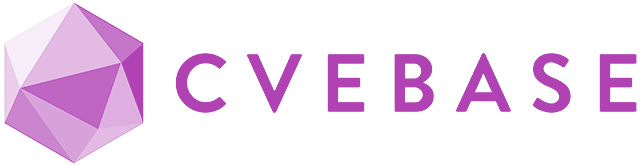

# KaaS | Kenzer-as-a-Service

[Kenzer](https://github.com/ARPSyndicate/kenzer) is our *opensource automation engine that uses multiple opensource tools for enumerating & scanning web assets* & this project i.e. *KaaS* aims to take it to the next level by *continuous monitoring of those enums & scans through Git repositories* that could be then shared among Bug Bounty Hunters, Web Security Researchers, etc.

| FEATURES			    | COMMUNITY EDITION	| PERSONAL EDITION	| PROFESSIONAL EDITION	    |
| --------------------- | ----------------- | ----------------- | ------------------------- |
| Access to HuntDB      | YES				| YES				| YES					    |
| Custom Targets        | NO				| 2					| 3						    |
| On-demand Modules     | NO				| TIER1 + TIER2		| TIER1 + TIER2 + TIER3     |
| Concurrent Modules    | NO				| NO				| 2						    |
| Max Module Requests   | NO				| 3/day 			| 5/day						|
| Kenzer Templates      | PUBLIC			| PUBLIC+CUSTOM(5)  | PUBLIC+PRIVATE+CUSTOM(10) |
| Pricing (Monthly)     | $5 or 10 PRs		| $10 or 25 PRs		| $15 or 50 PRs			    |

## Module Tiers
**TIER1** : subenum, portenum, webenum, asnenum, dnsenum, headenum, favscan, monitor 
**TIER2** : subscan, cvescan, buckscan, cscan, socscan 
**TIER3** : idscan, vulnscan, portscan, vizscan 

## Kenzer Templates
**PUBLIC**[639] : cvescan[221], idscan[129], vulnscan[282], subscan[7] 
**PRIVATE**[1063] : cvescan[373], idscan[164], vulnscan[519], subscan[7] 

## Repositories eligible for PRs
[cvebase/cvebase.com](https://github.com/cvebase/cvebase.com) 
[jaeles-project/jaeles-signatures](https://github.com/jaeles-project/jaeles-signatures) 
[vulhub/vulhub](https://github.com/vulhub/vulhub) 
[projectdiscovery/nuclei-templates](https://github.com/projectdiscovery/nuclei-templates) 
[python/cpython](https://github.com/python/cpython) 
[1N3/Sn1per](https://github.com/1N3/Sn1per) 
[infobyte/faraday_plugins](https://github.com/infobyte/faraday_plugins) 
[liberapay/liberapay.com](https://github.com/liberapay/liberapay.com) 
[torvalds/linux](https://github.com/torvalds/linux) 
[BlackArch/blackarch](https://github.com/BlackArch/blackarch) 
[ArchStrike/ArchStrike](https://github.com/ArchStrike/ArchStrike) 
[swisskyrepo/PayloadsAllTheThings](https://github.com/swisskyrepo/PayloadsAllTheThings) 
[zulip/zulip](https://github.com/zulip/zulip) 
[future-architect/vuls](https://github.com/future-architect/vuls) 
[ytisf/theZoo](https://github.com/ytisf/theZoo) 
[GTFOBins/GTFOBins.github.io](https://github.com/GTFOBins/GTFOBins.github.io) 

## HuntDB
[HuntDB](http://github.com/ARPSyndicate/huntdb) is our private *kenzerdb* repository that stores weekly updated [recon data](huntdb_readme.md) collected using *TIER1* modules for [1500+ domains](huntdb_domains.txt). Apart from those who take subscriptions for either of the available editions, we'll be randomly picking up a [stargazer](https://github.com/ARPSyndicate/kenzer/stargazers) every now & then for *free monthly/weekly access to Community Edition*.

## Getting Started
1. [Raise an issue](https://github.com/ARPSyndicate/KaaS/issues) mentioning your PRs that got merged in year *2021* to any of the eligible repositories.
2. [Sponsor us via Liberapay](https://liberapay.com/glatisant) & make sure your GitHub account is connected & publicly visible on Liberapay.

**In either case, you need to accept the Github Invitation sent to the email connected to your GitHub for proceeding any further.**

## Disclaimer
1. No subscriber, at no time, will have a direct access to our Kenzer deployments. *All inputs will be taken via Github Issues & will be passed to Kenzer manually by us*.
2. *All the results for on-demand modules will be synced to a private github repository automatically* & if in case any *Tier1* module is requested, its *result will be automatically pushed to HuntDB after a period of 6 days*.
3. Custom Targets refer to the *targets not already present in HuntDB but are in scope of a BBP/VDP*.
4. All *private/custom templates will stay private* at all times & might throw false positives at certain times.
5. We only *detect if a vulnerability is present* & won't provide any assistance in exploitation at any point of time.
6. Completion of any module depends on the number of targets & the module being used. But we'll try our best to keep it in range of *30 minutes to 30 hours*. If it goes beyond that, then you'll be given *free access to Community Edition for a week*.
7. Only *one domain per module is allowed*.
8. This project's sole purpose is to *detect & report vulnerabilities before it gets exploited for malicious purposes*. Although this is meant to be used for BBP/VDP but at many times some of the subdomains tends to be explicitly defined as *out-of-scope* by these programs. For example 
_*.cyberoam.com is in scope but *.ddns.cyberoam.com is out-of-scope as per Sophos BBP_. For that purpose we decided that we will *exclude them from the results of Tier2 & Tier3 modules*.

[Raise an issue](https://github.com/ARPSyndicate/KaaS/issues) in case of any other queries/issues.  

## Noteworthy Projects
  

